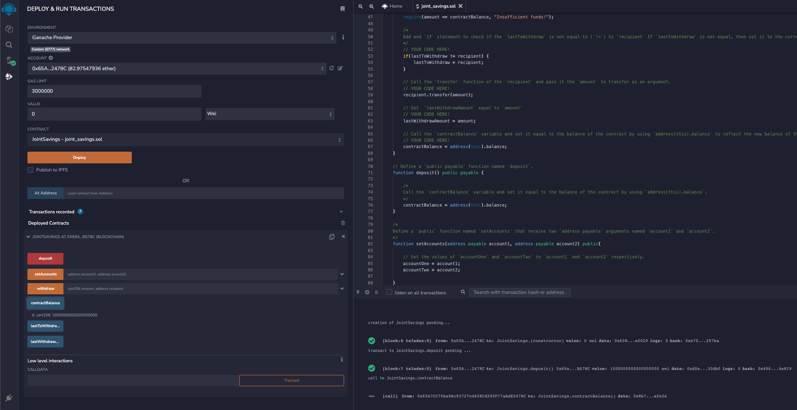

# Joint Savings Account Manager
## A Solidity Smart Contract Implementation

## Technologies

This Joint Savings Account Manager payment transfer system was built with the following technologies:

### Language

| Language | Version |
|----------|---------|
| Solidity | 0.5.0   |
| Remix    | 0.23.3  |


### Operating System

This version of the software is operating system agnostic.

---
## Installation Guide

### Pre-requisites

- Remix web browser with Solidity 0.5.0

### Running the Savings Account Manager

1. Compile joint_savings.sol from Remix IDE.


2. Deploy the Joint Savings smart contract.


3. Setup Accounts.


4. Deposit Ether(s) into the smart contract and check balance.




5. Withdraw Ether(s) to account(s) via smart contact and check Last Withdrawal details.


6. Observe withdraw details in terminal.


---
## Contributors

```markdown
{
  "name": "Ashok Kumar Madhavi Selvaraj",
  "email": "ashok.ms.kumar@gmail.com",
  "linkedin": "https://www.linkedin.com/in/msashokkumar"
}
```
---

## License

Please refer to LICENSE.